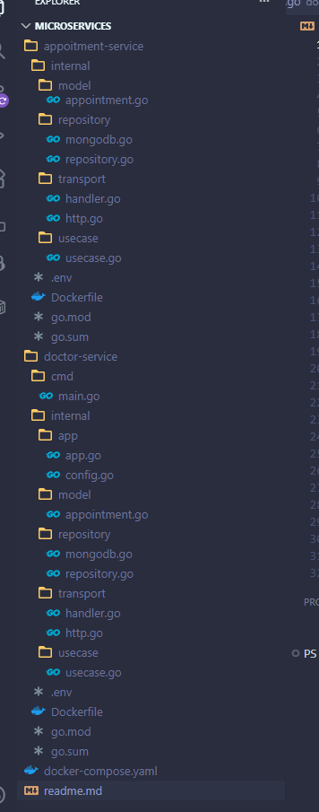

# Medical Appointment Microservices

A Go-based microservices system for managing doctors and medical appointments, using MongoDB.

## Project Overview

This project is a simple medical scheduling system based on microservices.  
It consists of two services: Doctor Service and Appointment Service.

The goal is to demonstrate Clean Architecture principles and service separation.  
Each service has its own responsibility and communicates using REST.

The system shows how to split a monolith into independent services with clear boundaries.

## Architecture

The project consists of two independent microservices that communicate over HTTP:

```
┌─────────────────────┐        HTTP        ┌──────────────────────┐
│  appointment-service │ ────────────────► │    doctor-service     │
│      :8082           │  (validates doctor)│       :8081           │
└──────────┬──────────┘                    └──────────┬────────────┘
           │                                           │
           └──────────────────┬────────────────────────┘
                              ▼
                        ┌──────────┐
                        │  MongoDB │
                        │  :27017  │
                        └──────────┘
```

- **doctor-service** — doctor managements (CRUD)
- **appointment-service** — appointments management

## Service Responsibilities

- **Doctor Service**
  - Stores and manages doctor data
  - Ensures email uniqueness
  - Provides doctor information through REST API

- **Appointment Service**
  - Stores and manages appointments
  - Validates if doctor exists through Doctor Service
  - Controls appointment status logic

## Why This is Microservices

This system is not a distributed monolith because:

- each service has its own data
- services communicate only via REST
- no direct database access between services

This creates clear service boundaries and independence.


## Tech Stack

- **Language:** Go
- **Framework:** Gin
- **Database:** MongoDB
- **Containerization:** Docker + Docker Compose

## Project Structure



## Dependency Flow

The project follows Clean Architecture:

- Transport layer depends on Use Case layer
- Use Case layer depends on interfaces
- Repository implements these interfaces
- Domain models do not depend on any framework

This keeps the code modular and easy to test.


`

## API Reference

### Doctor Service — `http://localhost:8081`

| Method | Endpoint              | Description          |
|--------|-----------------------|----------------------|
| POST   | `/api/v1/doctors/`    | Create doctor        |
| GET    | `/api/v1/doctors/`    | List of all doctors  |
| GET    | `/api/v1/doctors/:id` | Get doctor by ID     |

**Doctor model:**
```json
{
  "id": "ObjectID",
  "name": "string",
  "specialization": "string",
  "email": "string"
}
```

---

### Appointment Service — `http://localhost:8080`

| Method | Endpoint                         | Description                  |
|--------|----------------------------------|------------------------------|
| POST   | `/api/v1/appointments`           | Create an appointment        |
| GET    | `/api/v1/appointments/`          | List of all appointment      |
| GET    | `/api/v1/appointments/:id`       | Get an appointment by ID     |
| PATCH  | `/api/v1/appointments/:id/status`| Patch status                 |

**Appointment model:**
```json
{
  "id": "ObjectID",
  "title": "string",
  "description": "string",
  "doctor_id": "ObjectID",
  "status": "new | in_progress | done",
  "created_at": "datetime",
  "updated_at": "datetime"
}
```

**PATCH body:**
```json
{
  "status": "in_progress"
}
```

## Environment Variables

| Variable            | Description                            | Default                    |
|---------------------|----------------------------------------|-----------------------------|
| `MONGO_URI`         | MongoDB connection string              | `mongodb://localhost:27017` |
| `PORT`              | HTTP server port                       | `:8080`                     |
| `DOCTOR_SERVICE_URL`| URL doctor-service (appointment only)  | `http://doctor-service:8080`|


## Inter-service Communication

The Appointment Service calls the Doctor Service through HTTP.

Before creating or updating an appointment, it sends a request:
GET /doctors/{id}

If the doctor exists → operation continues  
If not → returns error

This ensures data consistency between services.

## Why Not Shared Database

Each service has its own database to keep clear boundaries.

If services shared one database:
- they would be tightly coupled
- changes in one service could break another

Separate databases follow microservices principles and improve scalability.

## Failure Scenario

If the Doctor Service is unavailable:

- Appointment Service cannot validate doctor
- It returns an error to the client
- The operation is not completed

In production systems, we could add:
- timeouts
- retries

This would make the system more reliable.
